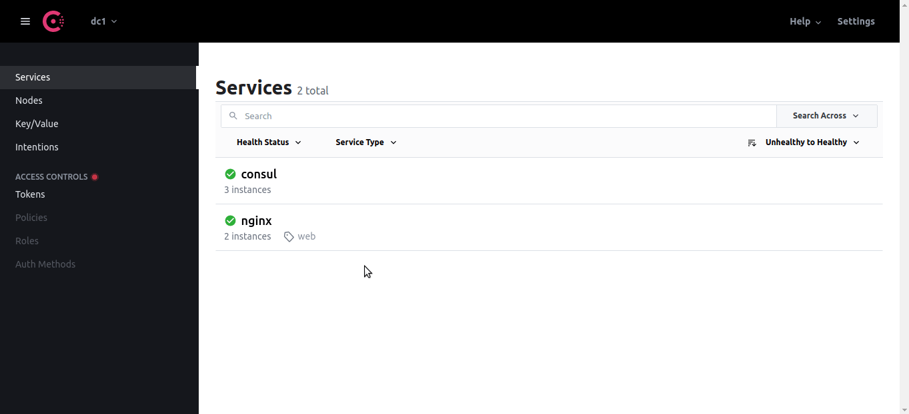

# full-cycle-2.0-service-discovery-consul

Files I produced during the "Service Discovery and Consul" classes of my [Microservices Full Cycle 3.0 course](https://drive.google.com/file/d/1bJnFxQPKgSsI30sCvW-KzYK4V5JWzgSs/view?usp=share_link).

## HashiCorp Consul


## Running consul in Dev mode

```sh
docker-compose up -d

# After consul container startup, go inside it:
docker-compose exec consulserver01 sh

# Then run:
consul agent -dev
```

### Open another terminal and run:

```sh
docker-compose exec consulserver01 sh

consul members  # You should see the agent started above

# To see your nodes metadata:
curl localhost:8500/v1/catalog/nodes
```

### As Consul comes with a DNS Server, we will install the dig command in Alpine to test it:

```sh
apk add -U bind-tools

dig @localhost -p 8600 consulserver01.node.consul  # Consult the DNS server
```

### You should see something like that:

```
; <<>> DiG 9.16.20 <<>> @localhost -p 8600 consulserver01.node.consul
; (1 server found)
;; global options: +cmd
;; Got answer:
;; ->>HEADER<<- opcode: QUERY, status: NOERROR, id: 40676
;; flags: qr aa rd; QUERY: 1, ANSWER: 1, AUTHORITY: 0, ADDITIONAL: 2
;; WARNING: recursion requested but not available

;; OPT PSEUDOSECTION:
; EDNS: version: 0, flags:; udp: 4096
;; QUESTION SECTION:
;consulserver01.node.consul.          IN      A

;; ANSWER SECTION:
consulserver01.node.consul.   0       IN      A       127.0.0.1

;; ADDITIONAL SECTION:
consulserver01.node.consul.   0       IN      TXT     "consul-network-segment="

;; Query time: 27 msec
;; SERVER: 127.0.0.1#8600(127.0.0.1)
;; WHEN: Fri Aug 20 12:07:43 UTC 2021
;; MSG SIZE  rcvd: 101
```

## Running consul in Server mode

This should be the final result after following this README:

http://localhost:8500



### Starting consulserver01

```sh
docker-compose up -d

# After consul container startup, go inside it:
docker-compose exec consulserver01 sh

# And run:
consul keygen
# Generates a cryptographic key that everyone should use to communicate in the cluster
# Output should be like: YGsICA9Fwq6TmFQI/qm4qIbdITrhvnHAsfZElu2czlk=

ifconfig  # Get your ip address from the docker interface, usually eth0. Mine is 172.25.0.2

mkdir /etc/consul.d
mkdir /var/lib/consul

consul agent -server \
    -bootstrap-expect=3 \
    -node=consulserver01 \
    -bind=172.25.0.2 \
    -data-dir=/var/lib/consul \
    -config-dir=/etc/consul.d \
    -encrypt=YGsICA9Fwq6TmFQI/qm4qIbdITrhvnHAsfZElu2czlk= \
    -ui \
    -client=0.0.0.0
```

### Open another terminal and start consulserver02:

```sh
docker-compose exec consulserver02 sh

ifconfig  # Get your ip address from the docker interface, usually eth0. Mine is 172.25.0.3

mkdir /etc/consul.d
mkdir /var/lib/consul

consul agent -server \
    -bootstrap-expect=3 \
    -node=consulserver02 \
    -bind=172.25.0.3 \
    -data-dir=/var/lib/consul \
    -config-dir=/etc/consul.d \
    -encrypt=YGsICA9Fwq6TmFQI/qm4qIbdITrhvnHAsfZElu2czlk=
```

### Open another terminal, go to the consulserver01 and join the consulserver02:

```sh
docker-compose exec consulserver01 sh

consul join 172.25.0.3  # This is the ip of consulserver02

consul members  # You should see two members now
```

### Open another terminal and start consulserver03:

```sh
docker-compose exec consulserver03 sh

ifconfig  # Get your ip address from the docker interface, usually eth0. Mine is 172.25.0.4

mkdir /etc/consul.d
mkdir /var/lib/consul

consul agent -server \
    -bootstrap-expect=3 \
    -node=consulserver03 \
    -bind=172.25.0.4 \
    -data-dir=/var/lib/consul \
    -config-dir=/etc/consul.d \
    -encrypt=YGsICA9Fwq6TmFQI/qm4qIbdITrhvnHAsfZElu2czlk=
```

### Open another terminal, go to the consulserver03 and join the consulserver02:

```sh
docker-compose exec consulserver03 sh

consul join 172.25.0.3  # This is the ip of consulserver02

consul members  # You should see three members now
```

### Open another terminal, go to the consulclient01 and run:

```sh
docker-compose exec consulclient01 sh

ifconfig  # Get your ip address from the docker interface, usually eth0. Mine is 172.25.0.5

mkdir /etc/consul.d
mkdir /var/lib/consul

consul agent \
    -bind=172.25.0.5 \
    -data-dir=/var/lib/consul \
    -config-dir=/etc/consul.d \
    -encrypt=YGsICA9Fwq6TmFQI/qm4qIbdITrhvnHAsfZElu2czlk=
```

### Open another terminal, go to the consulclient01 and run:

```sh
docker-compose exec consulclient01 sh

consul join 172.25.0.3  # This is the ip of consulserver02

consul members  # Now you should see 4 members

consul reload  # To ensure consul will load the services.json file

apk add -U bind-tools  # To install the dig command

dig @localhost -p 8600 nginx.service.consul  # Consult the DNS server for the nginx service
```

### You should see something like that:

```
; (1 server found)
;; global options: +cmd
;; Got answer:
;; ->>HEADER<<- opcode: QUERY, status: NOERROR, id: 10158
;; flags: qr aa rd; QUERY: 1, ANSWER: 1, AUTHORITY: 0, ADDITIONAL: 1
;; WARNING: recursion requested but not available

;; OPT PSEUDOSECTION:
; EDNS: version: 0, flags:; udp: 4096
;; QUESTION SECTION:
;nginx.service.consul.          IN      A

;; ANSWER SECTION:
nginx.service.consul.   0       IN      A       172.25.0.5

;; Query time: 3 msec
;; SERVER: 127.0.0.1#8600(127.0.0.1)
;; WHEN: Fri Aug 20 12:52:11 UTC 2021
;; MSG SIZE  rcvd: 65
```

### Still inside the consulclient01 run:

```sh
curl localhost:8500/v1/catalog/services
# Output should be {"consul":[],"nginx":["web"]}

consul catalog nodes -service nginx
# Output should be like:
# Node            ID        Address     DC
# consulclient01  670e9dfc  172.25.0.5  dc1

consul catalog nodes -detailed
# Output should be like:
# Node            ID                                    Address     DC   TaggedAddresses                                                           Meta
# consulclient01  670e9dfc-fd4d-2b45-b483-8fe40057fc96  172.25.0.5  dc1  lan=172.25.0.5, lan_ipv4=172.25.0.5, wan=172.25.0.5, wan_ipv4=172.25.0.5  consul-network-segment=
# consulserver01  60dafa67-31bd-0a2b-b884-ea462a8db3d8  172.25.0.2  dc1  lan=172.25.0.2, lan_ipv4=172.25.0.2, wan=172.25.0.2, wan_ipv4=172.25.0.2  consul-network-segment=
# consulserver02  812f24ab-c7a6-80b1-4748-c53ccfa524da  172.25.0.3  dc1  lan=172.25.0.3, lan_ipv4=172.25.0.3, wan=172.25.0.3, wan_ipv4=172.25.0.3  consul-network-segment=
# consulserver03  8cc0664d-f28e-de2f-b3c6-ab1c9c12aa00  172.25.0.4  dc1  lan=172.25.0.4, lan_ipv4=172.25.0.4, wan=172.25.0.4, wan_ipv4=172.25.0.4  consul-network-segment=
```

### Open another terminal, go to the consulclient02 and run:

```sh
docker-compose exec consulclient02 sh

ifconfig  # Get your ip address from the docker interface, usually eth0. Mine is 172.25.0.6

mkdir /etc/consul.d
mkdir /var/lib/consul

consul agent \
    -bind=172.25.0.6 \
    -data-dir=/var/lib/consul \
    -config-dir=/etc/consul.d \
    -encrypt=YGsICA9Fwq6TmFQI/qm4qIbdITrhvnHAsfZElu2czlk= \
    -retry-join=172.25.0.3 \
    -retry-join=172.25.0.4 \
    -retry-join=172.25.0.2  # If cannot join one server, try the others
```

### Open another terminal, go to the consulclient02 and run:

```sh
docker-compose exec consulclient02 sh

apk add -U bind-tools  # To install the dig command

# Consult the DNS server, you should see only one ip for the
# nginx service because of the healthcheck for nginx2 
dig @localhost -p 8600 nginx.service.consul

apk add nginx
mkdir /run/nginx
nginx
ps
curl localhost  # To see if nginx is working

# Replace nginx default.conf
echo "# This is a default site configuration which will simply return 404, preventing
# chance access to any other virtualhost.

server {
        listen 80 default_server;
        listen [::]:80 default_server;

        root /usr/share/nginx/html;

        # You may need this to prevent return 404 recursion.
        location = /404.html {
                internal;
        }
}" > /etc/nginx/conf.d/default.conf

mkdir -p /usr/share/nginx/html
echo "Nginx Service / HashiCorp Consul!!!" > /usr/share/nginx/html/index.html
nginx -s reload
curl localhost

dig @localhost -p 8600 nginx.service.consul  # Now you should see two ips for the nginx service

# If you wanna see the encryption working, run:
apk add tcpdump
tcpdump -i eth0 -an port 8301 -A
```
